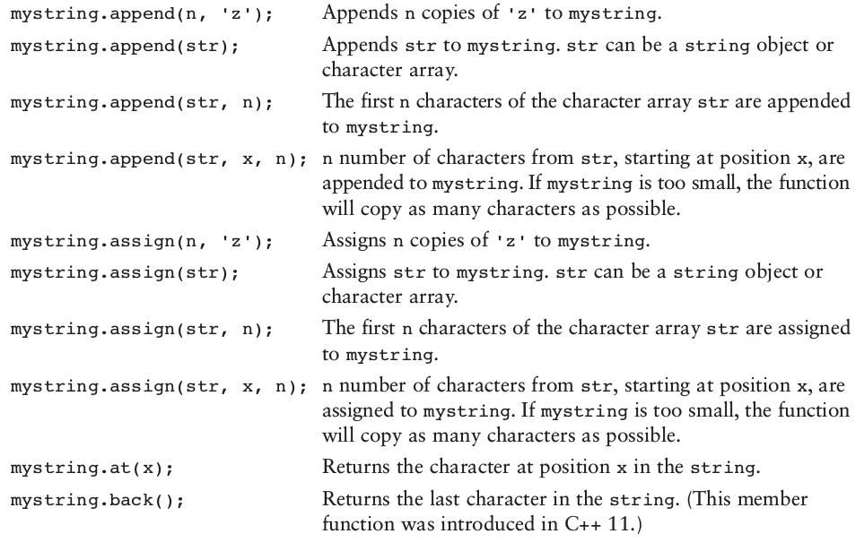
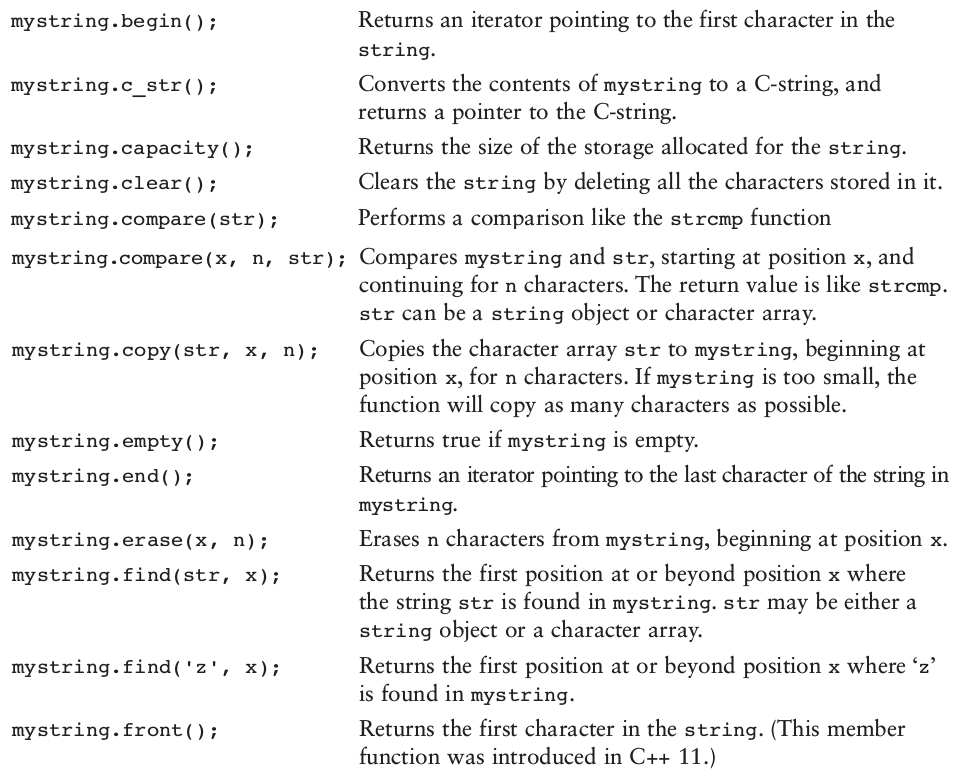
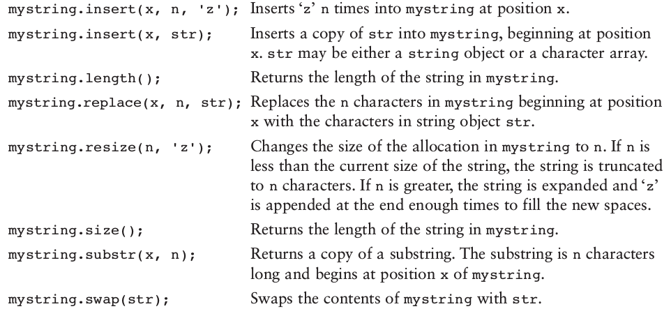
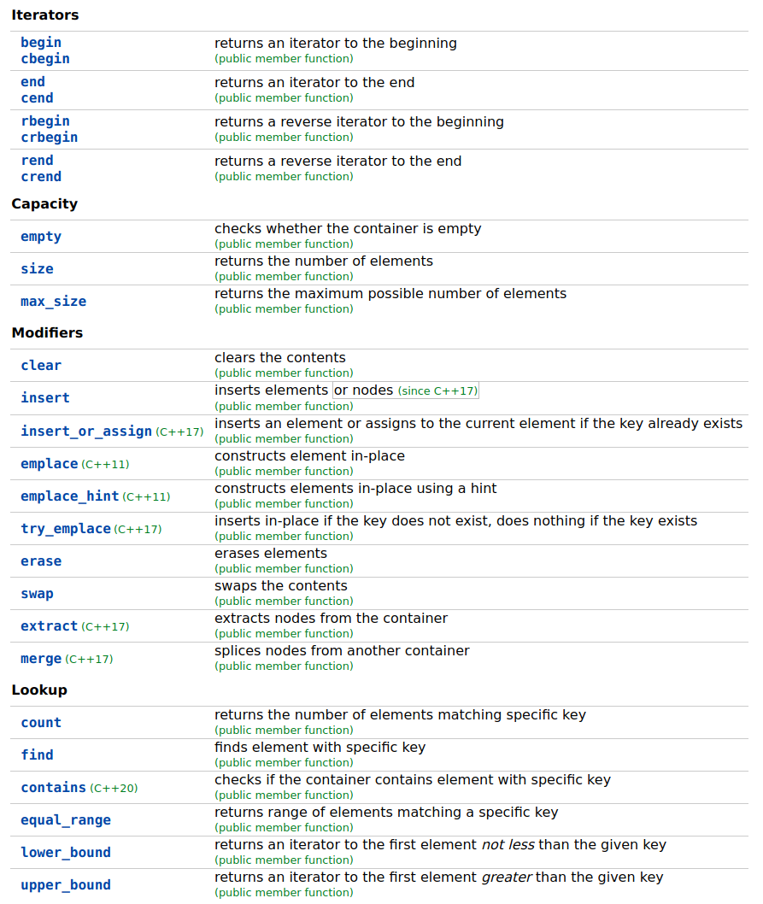
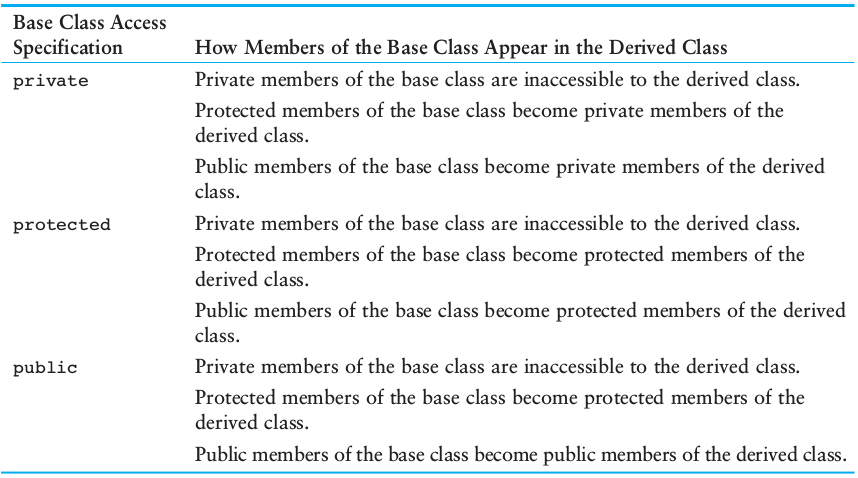
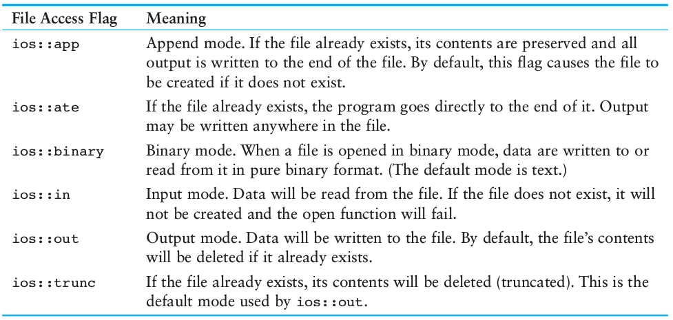
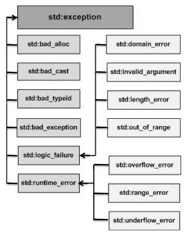

# C++ Quick Reference

 1. [Namespaces](#1-namespaces)
 2. [Memory Management](#2-memory-management)<br>
    2.1. [Raw Pointers](#21-raw-pointers)<br>
    2.2. [Smart Pointers](#22-smart-pointers)<br>
    2.3. [References](#23-references)
 3. [Characters & Strings](#3-characters-and-strings)<br>
    3.1. [Character Functions](#31-character-functions)<br>
    3.2. [C-String Functions](#32-c-string-functions)<br>
    3.3. [Strings](#33-strings)
 4. [Data Structures](#4-data-structures)<br>
    4.1. [Vectors](#41-vectors)<br>
    4.2. [Maps](#42-maps)
 5. [Structs & Classes](#5-structs-and-classes)<br>
    5.1. [Structs](#51-structs)<br>
    5.2. [Classes](#52-classes)<br>
    5.3. [Inheritance](#53-inheritance)<br>
    5.4. [Enumerated Data Types](#54-enumerated-data-types)
 6. [Templates](#6-templates)<br>
    6.1. [Function Templates](#61-function-templates)<br>
    6.2. [Class Templates](#62-class-templates)
 7. [File Operations](#7-file-operations)
 8. [Exceptions](#8-exceptions)
 9. [Operator Overloading](#9-operator-overloading)
 10. [`auto` Keyword](#10-auto-keyword)

## 1. Namespaces

Namespaces provide a method for preventing name conflicts in large projects.

Symbols declared inside a namespace block are placed in a named scope that prevents them from being mistaken for identically-named symbols in other scopes.

Multiple namespace blocks with the same name are allowed. All declarations within those blocks are declared in the named scope.

```cpp
// this line should not be put in headers because it defeats the purpose of using namespaces
using namespace std;
```

The line above allows you to directly use use functions & variables from `std` namespace:

```cpp
cout << "Hello world." << endl;
```

as opposed to:

```cpp
std::cout << "Hello world." << std::endl;
```

On the other hand, the following lets you use only `cout` & `endl` directly from `std:`

```cpp
using std::cout;
using std::endl;
```

#### Example

```cpp
#include <iostream>

namespace first
{
    int getVal()
    {
        return 5;
    }
}

namespace second
{
    const double x = 100;

    double getVal()
    {
        return 2 * x;
    }
}

using namespace std;
using second::x;

int main()
{
    // access function within first
    cout << first::getVal() << endl;

    // access function within second
    cout << second::getVal() << endl;

    // access variable x directly
    cout << x << endl;
}
```

#### Declarations & Definitions in Namespaces

```cpp
namespace Q
{
    // V is a member of Q, and is fully defined within Q
    namespace V
    {
        // C is a member of V and is fully defined within V
        class C
        {
            // C::m is only declared
            void m();
        };

        // f is a member of V, but is only declared here
        void f();
    }

    // definition of V's member f outside of V
    // f's enclosing namespaces are still the global namespace, Q, and Q::V
    void V::f()
    {
        // This declares ::Q::V::h
        extern void h();
    }

    // definition of V::C::m outside of the namespace (and the class body)
    // enclosing namespaces are the global namespace, Q, and Q::V
    void V::C::m()
    {
    }
}
```

#### Anonymous Namespaces

You can define anonymous namespaces to hide variables, types and functions from the end user. Anonymous namespaces are available only in their translation unit.

As an example, check out the [header](code/multiply.h) and [implementation](code/multiply.cpp) files of the `multiply` namespace which can be used as follows:

```cpp
#include <iostream>
#include "multiply.h"

int main(int argc, char **argv)
{
    std::cout << multiply::getFirst();      // OK
    std::cout << multiply::getProduct();    // OK
    std::cout << multiply::calc(3, 6);      // ERROR: 'calc' is not a member of 'multiply'
    std::cout << multiply::first;           // ERROR: 'first' is not a member of 'multiply'
}
```

## 2. Memory Management

Keywords `new` and `delete` in C++ replace `malloc` and `free` in C, with the exception that `new` and `delete` call the constructor and destructor as well.

#### Primitive Values

```cpp
int x = 5;                      // create an int on the stack
                                // automatically freed when calling function returns

int* y = new int(5);            // crates an integer on the heap, has to be freed manually using 'delete'
delete y;                       // frees heap memory occupied by y
y = nullptr;                    // good practice for preventing errors
```

#### Classes & Objects

```cpp
class Person
{
    // constructor
    // destructor
    // other members
}

Person* person = new Person();  // calls the constructor & instantiates a Person object
delete person;                  // calls the destructor & frees heap memory occupied by person
person = nullptr;
```

#### Arrays

```cpp
char* s = new char[size];       // dynamically allocates memory for an array
delete [] s;                    // frees the allocated memory
s = nullptr;
```

### 2.1. Raw Pointers

```cpp
// this function accepts a pointer to an array of constants
void displayPayRates(const double* rates, int size)
{
    for (int count = 0; count < size; count++)
    {
        cout << rates[count] << endl;
    }
}

// constant pointers can not point to something else
int value = 22;
int* const ptr = &value;

// this is a constant pointer to a constant
int number = 15;
const int* const ptr = &number;
```

### 2.2. Smart Pointers

Smart pointers are defined in the `std` namespace in the `<memory>` header file.

In most cases, when you initialize a raw pointer or resource handle to point to an actual resource, pass the pointer to a smart pointer immediately. In modern C++, raw pointers are only used in small code blocks of limited scope, loops, or helper functions where performance is critical and there is no chance of confusion about ownership.

#### Types of Smart Pointers

**`unique_ptr`**<br>
Allows exactly one owner of the underlying pointer. Use as the default choice for POCO unless you know for certain that you require a `shared_ptr`. Can be moved to a new owner, but not copied or shared. The size is one pointer and it supports `rvalue` references for fast insertion and retrieval from C++ Standard Library collections.

**`shared_ptr`**<br>
Reference-counted smart pointer. Use when you want to assign one raw pointer to multiple owners, for example, when you return a copy of a pointer from a container but want to keep the original. The raw pointer is not deleted until all `shared_ptr` owners have gone out of scope or have otherwise given up ownership. The size is two pointers; one for the object and one for the shared control block that contains the reference count.

**`weak_ptr`**<br>
Special-case smart pointer for use in conjunction with `shared_ptr`. Provides access to an object that is owned by one or more `shared_ptr` instances, but does not participate in reference counting. Use when you want to observe an object, but do not require it to remain alive. Required in some cases to break circular references between `shared_ptr` instances.

```cpp
void useRawPointer()
{
    // using a raw pointer
    Song* pSong = new Song("Nothing on You", "Bruno Mars");

    // use pSong...

    // don't forget to delete!
    delete pSong;
}

void useSmartPointer()
{
    // declare a smart pointer on stack and pass it the raw pointer
    unique_ptr<Song> song2(new Song("Nothing on You", "Bruno Mars"));

    // use song2...
    string s = song2->name;
    // ...

} // song2 is deleted automatically here
```

The smart pointer destructor contains the call to delete, and because the smart pointer is declared on the stack, its destructor is invoked when the smart pointer goes out of scope, even if an exception is thrown somewhere further up the stack.

Smart pointers have their own member functions, which are accessed by using “dot” notation. For example, some C++ Standard Library smart pointers have a reset member function that releases ownership of the pointer. This is useful when you want to free the memory owned by the smart pointer before the smart pointer goes out of scope, as shown in the following example.

```cpp
class LargeObject
{
    public:
        void DoSomething() {}
};

void processLargeObject(const LargeObject& lo) {}
void legacyLargeObjectFunction(LargeObject* lo) {};

void smartPointerDemo()
{
    // create the object and pass it to a smart pointer
    std::unique_ptr<LargeObject> pLarge(new LargeObject());

    // call a method on the object
    pLarge->DoSomething();

    // pass a reference to a method
    processLargeObject(*pLarge);

    // pass raw pointer to a legacy API
    legacyLargeObjectFunction(pLarge.get());

    // free the memory before we exit function block
    pLarge.reset();

    // do some other work...
}
```

### 2.3. References

A reference variable is an alias, that is, another name for an already existing variable. A reference, like a pointer is also implemented by storing the address of an object.
A reference can be thought of as a constant pointer (not to be confused with a pointer to a constant value) with automatic indirection, i.e the compiler will apply the \* operator for you.

#### Example

```cpp
// i and j are pointers to ints
void swap(int* i, int *j)
{
    int temp = *i; // dereference i
    *i = *j;
    *j = temp;
}

// have to pass pointers to a and b
swap(&a, &b);
```

```cpp
// i and j are references to ints
inline void swap(int &i, int &j)
{
    int temp i; // no need to dereference
    i = j;
    j = temp;
}

// no need to pass pointers
swap(a, b);
```

## 3. Characters and Strings

### 3.1. Character Functions

```cpp
#include <cctype>   // required for using the functions below
```

#### Character testing

| Function  | Returns true if the argument is a ...; returns 0 otherwise  |
| :-------: | :---------------------------------------------------------- |
| `isalpha` | letter of the alphabet.                                     |
| `isalnum` | letter of the alphabet or a digit.                          |
| `isdigit` | digit from 0 through 9.                                     |
| `islower` | lowercase letter.                                           |
| `isprint` | printable character (including a space).                    |
| `ispunct` | printable character other than a digit, letter, or space.   |
| `isupper` | uppercase letter. Otherwise, it returns 0.                  |
| `isspace` | whitespace character. (`' '`, `' \n '`, `' \v '`, `' \t '`) |

#### Character case conversion

| Function  | Description                                       |
| :-------: | :------------------------------------------------ |
| `toupper` | Returns the uppercase equivalent of its argument. |
| `tolower` | Returns the lowercase equivalent of its argument. |

### 3.2. C-String Functions

```cpp
#include <cstring>  // required for using the functions below
```

#### `strlen`

```cpp
// don't confuse the length of a string with the size of the array holding it
char name[] = "banana";
int length = strlen(name); // length is 6
```

#### `strcat` (see also: [`strncat`](http://www.cplusplus.com/reference/cstring/strncat/))

_If the array holding the first string isn't large enough to hold both strings,
`strcat` will overflow the boundaries of the array._

```cpp
char string1[100] = "Hello ";   // string1 has enough capacity for strcat
char string2[] = "World!";
strcat(string1, string2);
cout << string1 << endl;        // outputs "Hello World!"
```

#### `strcpy` (see also: [`strncpy`](http://www.cplusplus.com/reference/cstring/strncpy/))

_`strcpy` performs no bounds checking. The array specified by the first
argument will be overflowed if it isn’t large enough to hold the string
specified by the second argument._

```cpp
char name[] = "Some other string";  // size of the holding array is sufficient
strcpy(name, "Albert Einstein");
```

#### `strstr`

```cpp
char arr[] = "Four score and seven years ago";
char *ptr = strstr(arr, "seven");   // search for "seven" and return address
cout << ptr << endl;                // outputs "seven years ago"
```

#### `strcmp`

```cpp
int strcmp(char *string1, char *string2); // function prototype
```

The result is

-   **zero** if the two strings are **equal**.
-   **negative** if `string1` comes **before** `string2` in alphabetical order.
-   **positive** if `string1` comes **after** `string2` in alphabetical order.

#### Numeric conversion functions

```cpp
// required for using the following functions
#include <cstdlib>

//Converts a c-string to an integer.
int intVal = atoi("1000");

//Converts a c-string to a long value.
long longVal = atol("1000000");

//Converts a c-string to a double/float value.
float floatVal = atof("12.67");
double doubleVal = atof("12.67");

// returns a numeric argument converted to a c-string object
to_string(int value);
to_string(long value);
to_string(long long value);
to_string(unsigned value);
to_string(unsigned long value);
to_string(unsigned long long value);
to_string(float value);
to_string(double value);
to_string(long double value);
```

### 3.3. Strings

#### Defining `string` objects

```cpp
#include <string>
using namespace std;

// defines an empty string
string str0;

// defines a string initialized with "Hello"
string str1 = "Hello";

// defines a string initialized with "Greetings!"
string str2("Greetings!");

// defines a string which is a copy of str2. (str2 may be a string or a c-string)
string str3(str2);

// this has to be a c-string, not a string
char cStr[] = "abcdefgh";

// defines a string which is initialized to the first 5 characters in cStr
string str4(cStr, 5);

// defines a string initialized with 10 'x' chars
string str5('x', 10);

// defines a string which is initialized with a substring of str5.
string str6(str5, 2, 8);
```

#### `string` operators

There is no need to use a function such as `strcmp` to compare string objects.
You may use the `<` , `>` , `<=` , `>=` , `==` , and `!=` relational operators.

```cpp
string s1 = "Hello ";
string s2 = "World!";
string mystring = s1 + s2;  // concatenates s1 and s2
char c = mystring[0];       // returns the char at position 0 in mystring
```

#### `string` member functions





### 4. Data Structures

### 4.1. Vectors

```cpp
#include <vector>
using namespace std;

vector<int> numbers1;                   // an empty vector of ints
vector<int> numbers2(10);               // a vector of 10 ints
vector<int> numbers3(10, 2);            // a vector of 10 ints, each initialized to 2
vector<int> numbers4 {10, 20, 30, 40};  // a vector initialized with an initialization list
vector<int> myVec(numbers4);            // a vector initialized with the elements of numbers4

int val = myVec.at(index);  // return the value of the element located at index of myVec
int* arr = myVec.data();    // return the underlying int array of myVec
myVec.push_back(50);        // create a last element (if myVec is full) and stores 50 in it
myVec.pop_back();           // remove the last element from myVec
myVec.size();               // get the number of elements in myVec
myvec.capacity();           // get the capacity of myVec
myVec.clear();              // completely clear the contents of myVec
myVec.empty();              // return true if myVec is empty
myVec.reverse();            // reverse the order of elements in myVec
myVec.resize(size, val);    // resize myVec. the new elements are initialized with val
myVec.swap(someVec);        // swap the contents of myVec with the contents of anotherVec
```

### 4.2. Maps

Maps are associative containers that store elements formed by a combination of a key value and a mapped value, following a specific order.

In a map, the key values are generally used to sort and uniquely identify the elements, while the mapped values store the content associated to this key. The types of key and mapped value may differ.

The mapped values in a map can be accessed directly by their corresponding key using the bracket operator `[]`.



## 5. Structs and Classes

Both `class` and `struct` declare a class. The only difference between the two is that structs have `public` members by default and classes have `private` members by default. Both classes and structs can have a mixture of public, protected and private members, can use inheritance and can have member functions.

Beyond syntax, the only reason to choose one over the other is convention/style/preference. Structs are usually used as plain old data structures without any class-like features, and classes are used as aggregate data structures with private data and member functions.

**Note:** _By default, structs/classes are passed to functions by value._<br>
**Note:** _You can return local structs/classes defined in functions unlike arrays._

### 5.1. Structs

```cpp
// declare a struct
struct CityInfo
{
    string cityName;
    string state;
    long population;
    int distance;
};

// define a struct
CityInfo location;
CityInfo cities[20];

// initialize a struct
CityInfo location = {"Asheville", "NC", 50000, 28};
CityInfo location = {"Atlanta"};  // only cityName is initialized
CityInfo cities[2] = {{"Asheville", "NC", 50000, 28},
                      {"Atlanta", "GA", 45000, 90}};

// access struct members
location.population = 4750;
cout << location.population << endl;

// declare a nested struct
struct EmployeeInfo
{
    string name;
    int employeeNumber;
    CityInfo birthPlace;
};

// access nested struct members
EmployeeInfo manager;
manager.birthPlace.population = 4750;
cout << manager.birthPlace.population << endl;
```

#### Dynamically allocating structs

```cpp
struct Circle
{
    double radius;
    double diameter;
    double area;
};

Circle* cirPtr = new Circle;
Circle* circles = new Circle[5];

// access members after dereferencing the struct pointer
cirPtr->radius = 1.1;
cirPtr->area = 2.2;

// array elements are structs, not pointers
for (int i = 0; i < 5; i++)
{
    circles[i].radius = 1.1 * i;
    circles[i].area = 2.2 * i;
}
```

### 5.2. Classes

Classes are usually made up of a specification file and an implementation file with extensions `.h` and `.cpp`; however it is also possible to put everyting inside a single `.h` file.

As a simple example, see the [specification](code/Rectangle.h) and [implementation](code/Rectangle.cpp) files of the Rectangle class.

#### Copy constructors and destructors

See the [ContactInfo](code/ContactInfo.h) class.

#### Objects

Here's some example usage of the [Rectangle](code/Rectangle.h) and [ContactInfo](ContactInfo.h) classes:

```cpp
// define an object from the Rectangle class (lives on stack)
Rectangle box1(12.8, 9.4);

// initialize the new object with width & length of box1 (lives on stack)
// c++ automatically creates a default copy constructor if it's not defined by programmer
Rectangle box2 = box1;  // numObjects not incremented because it's not handled in default copy constructor
box2.setWidth(4.7);     // assign a new width to box2

// call static member function
cout << "Number of objects: " << Rectangle::getNumObjects();    // Number of objects: 1

// define a pointer to a ContactInfo class object
// this object lives on the heap and should be deleted manually
ContactInfo* contactPtr = new ContactInfo("Kristen Lee", "555-2021");
contactPtr->getName();

// create a new contact and copy name & phone number from the previous one (lives on stack)
ContactInfo newContact = *contactPtr;       // our copy constructor is called here automatically
const char* newName = newContact.getName(); // same as "Kristen Lee"

// the destructor is called here automatically
delete contactPtr;
contactPtr = nullptr;   // good practice for preventing errors

// no need to delete other objects because they live on stack and will get deleted when the calling function returns
```

### 5.3. Inheritance

The parent class’s constructor is called before the child class’s constructor.<br>
The destructors are called in reverse order, with the child class’s destructor being called first.

See the [Cube](code/Cube.h) class which inherits from the [Rectangle](code/Rectangle.h) class.

**Base class access specification**<br>
<br>
**NOTE:** If the base class access specification is left out of a declaration, the default access specification is `private.`

#### Polymorphism

Any class that has a virtual member function should also have a virtual destructor.<br>
Even if the class doesn’t normally require a destructor, it should still have an empty virtual destructor.

See the [GradedActivity](code/GradedActivity.h) and [PassFailActivity](code/PassFailActivity.h) and then the example usage below:

```cpp
PassFailActivity pfActivity(70);
pfActivity.setScore(72);
displayGrade(pfActivity);

// polymorphism requires pass by reference or by pointer
void displayGrade(const GradedActivity &activity)
{
    cout << "The activity's letter grade is " << activity.getLetterGrade() << endl;
}
```

#### Abstract Classes

A **pure virtual function** is a virtual member function of a base class that **must be overridden**. When a class contains a pure virtual function as a member, that class becomes an **abstract class**.

```cpp
// this is a pure virtual function
virtual void foo() = 0;
```

### 5.4 Enumerated Data Types

```cpp
// each enumerator is assigned an integer starting from 0
enum Day
{
    MONDAY,     // 0
    TUESDAY,    // 1
    WEDNESDAY,  // 2
    THURSDAY,   // 3
    FRIDAY      // 4
};

// assign an enumerator to an integer
int x = THURSDAY;

// can not directly assign an int to an enum variable
Day day1 = static_cast<Day>(3);         // day1 = 3 is illegal!!
Day day2 = static_cast<Day>(day1 + 1);  // day2 = day1 + 1 is illegal!!

// compare enum values
bool b = FRIDAY > MONDAY;  // true because FIRDAY comes after MONDAY

// anonymous enum types can be used when you don't need to define variables
enum {MONDAY, TUESDAY, WEDNESDAY, THURSDAY, FRIDAY};

// can specify integer values for all or some enumerators
enum Color {RED, ORANGE, YELLOW = 9, GREEN, BLUE};
```

#### Strongly typed enumerators `(enum class)`

```cpp
// can specify multiple enumerators with the same name, within the same scope
enum class President {MCKINLEY, ROOSEVELT, TAFT};
enum class VicePresident {ROOSEVELT, FAIRBANKS, SHERMAN};

// can not directly assign a strongly typed enum to an integer
// int x = President::MCKINLEY is illegal!!
int x = static_cast<int>(President::MCKINLEY);

// can specify any integer data type as the underlying type
enum class Day : char {MONDAY, TUESDAY, WEDNESDAY, THURSDAY, FRIDAY};
```

## 6. Templates

### 6.1. Function Templates

```cpp
template <class T>
void swap(T &i, T &j)
{
    T temp = i;
    i = j;
    j = temp;
}

swap(a, b);
```

### 6.2. Class Templates

See the example [SimpleVector](code/SimpleVector.h) class.

## 7. File Operations

| Data Type  | Description                                                    |
| :--------: | :------------------------------------------------------------- |
| `ifstream` | Input file stream. Can be used to read data from files.        |
| `ofstream` | Output file stream. Can be used to create write data to files. |
| `fstream`  | File stream. Can be used to read and write data to/from files. |

#### `ifstream` and `ofstream`

```cpp
#include <fstream>

// open an ifstream
ifstream inputFile;
inputFile.open("InputFile.txt");
// Alternatively:
// ifstream inputFile("InputFile.txt");

// open an ofstream
ofstream outputFile;
outputFile.open("OutputFile.txt");
// Alternatively:
// ofstream outputFile("OutputFile.txt");

// open ofstream in append mode
outputFile.open("OutputFile.txt", ios::out | ios::app);

inputFile >> value;
outputFile << "I love C++ programming" << endl;

inputFile.close();
outputFile.close();
```

#### `fstream`

```cpp
#include <fstream>

fstream file;

// open fstream in output mode
file.open("DataFile.txt", ios::out);

// open fstream in both input and output modes
file.open("DataFile.txt", ios::in | ios::out);

// read and write data in binary mode
char data[4] = {'A', 'B', 'C', 'D'};
fstream file("DataFile.dat", ios::binary | ios::out);
file.write(data, sizeof(data));
file.open("DataFile.dat", ios::binary | ios::in);
file.read(data, sizeof(data));

// read and write non-char data
int numbers[10] = {1, 2, 3, 4, 5, 6, 7, 8, 9, 10};
fstream file("numbers.dat", ios::out | ios::binary);
file.write(reinterpret_cast<char *>(numbers), sizeof(numbers));
file.open("numbers.dat", ios::in | ios::binary);
file.read(reinterpret_cast<char *>(numbers), sizeof(numbers));

// close the file
file.close();
```

#### File access flags

By using different combinations of access flags, you can open files in many possible modes:


## 8. Exceptions

### Standard Exceptions



| Exception               | Description                                                                                |
| :---------------------- | :----------------------------------------------------------------------------------------- |
| `std::exception`        | An exception and parent class of all the standard C++ exceptions.                          |
| `std::bad_alloc`        | This can be thrown by new.                                                                 |
| `std::bad_cast`         | This can be thrown by dynamic_cast.                                                        |
| `std::bad_exception`    | This is useful device to handle unexpected exceptions in a C++ program.                    |
| `std::bad_typeid`       | This can be thrown by typeid.                                                              |
| `std::logic_error`      | An exception that theoretically can be detected by reading the code.                       |
| `std::domain_error`     | This is an exception thrown when a mathematically invalid domain is used.                  |
| `std::invalid_argument` | This is thrown due to invalid arguments.                                                   |
| `std::length_error`     | This is thrown when a too big std::string is created.                                      |
| `std::out_of_range`     | This can be thrown by the 'at' method, e.g. a std::vector and std::bitset<>::operator[](). |
| `std::runtime_error`    | An exception that theoretically cannot be detected by reading the code.                    |
| `std::overflow_error`   | This is thrown if a mathematical overflow occurs.                                          |
| `std::range_error`      | This is occurred when you try to store a value which is out of range.                      |
| `std::underflow_error`  | This is thrown if a mathematical underflow occurs.                                         |

### Throwing an Exception

```cpp
double divide(int numerator, int denominator)
{
    if (denominator == 0)
    {
        // throws an exception of type "string"
        throw string("ERROR: Cannot divide by zero.\n");
    }
    else
    {
        return static_cast<double>(numerator) / denominator;
    }
}
```

### Handling an Exception

```cpp
try
{
    double quotient = divide(num1, num2);
    cout << "The quotient is " << quotient << endl;
}
catch (string exceptionString)  // only catches exceptions of type "string"
{
    cout << exceptionString;
}
```

There are two possible ways for a thrown exception to go uncaught:

1. The try/catch construct contains no catch blocks with an exception parameter of the right data type.
2. The exception is thrown from outside a try block.

_In either case, the exception will cause the entire program to abort execution._

If an exception is thrown by the member function of a class object, then the class destructor is called. If any other objects had been created in the try block,their destructors will be called as well.

### Multiple Exceptions

```cpp
// define a custom exception class
class MyException: public std::exception
{
    public:
        MyException(const char* message) : msg(message) {}
        MyException(const std::string& message): msg(message) {}

        const char* what() const throw()
        {
            return msg.c_str();
        }

    protected:
        std::string msg;
};

double divide(int numerator, int denominator)
{
    if (denominator == 0)
    {
        // throws an exception of type "string"
        throw string("ERROR: Cannot divide by zero.\n");
    }
    else if (numerator < 0 || denominator < 0)
    {
        // throw an exception of type "MyException"
        throw MyException("Negative arguments not allowed!");
    }
    else
    {
        return static_cast<double>(numerator) / denominator;
    }
}

// use the function
try
{
    double quotient = divide(num1, num2);
    cout << "The quotient is " << quotient << endl;
}
catch (string msg)  // only catches exceptions of type "string"
{
    cout << msg;
}
catch (MyException& e)
{
    cout << "Error: " << e.what() << endl;
}
```

### Rethrowing an Exception

```cpp
try
{
    // assume that this function throws an exception of type "exception"
    doSomething();
}
catch(exception)
{
    throw;  // rethrow the exception
}
```

## 9. Operator Overloading

You can customize operators to work with your custom classes. Take a look at the [MyInt](code/MyInt.h) class to see an example. Some common operators that can be overloaded are the following:


## 10. `auto` Keyword

Starting from C++11, the `auto` keyword can be used to _infer_ the type of a variable.

```cpp
auto x = 5; // C++ will infer this is an integer
std::string myName = "Billy";
auto nameCopy = myName; // C++ will infer 'nameCopy' based on the 'myName' variable
```

Note that this only works when initializing a variable upon creation. Variables created without initialization values can not use this feature.

In C++14, the `auto` keyword was extended to be able to auto-deduce a function’s return type:

```cpp
auto add(int x, int y)
{
    return x + y;
}
```

Since `x + y` evaluates to an integer, the compiler will deduce this function should have a return type of `int`.

A good rule of thumb is that `auto` is okay to use when defining a variable, because the object the variable is inferring a type from is right there, on the right side of the statement. However, with functions, that is not the case -- there’s no context to help indicate what type the function returns. A user would actually have to dig into the function body itself to determine what type the function returned. It’s much less intuitive, and therefore more error prone.
